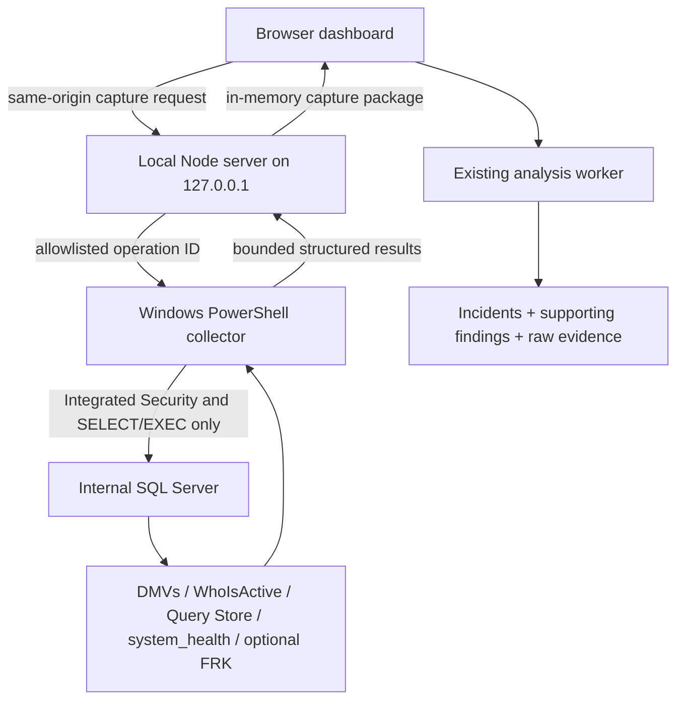

# Offline Connected SQL Investigation Implementation Plan

## Outcome

Add a case-oriented offline Deep Analysis workflow, followed by a Windows-first, manually initiated, read-only SQL Server capture path while preserving the existing file-only application. Replace repeated, independent observations with correct blocking graphs, evidence-state causal investigations, query- and plan-specific evidence, and one prioritized investigation recipe.

The work is staged so manual SSMS collection, portable case archives, and deterministic evidence evaluation become useful before any connection code is introduced.

---

## Architecture

The browser never receives database credentials and cannot submit arbitrary SQL. The Node server accepts only named capture operations, and the PowerShell collector maps those names to packaged read-only queries. Captured evidence is returned to the browser and remains in memory unless explicitly exported.

---

## Key Technical Decisions

- **Use Windows PowerShell 5.1 and `System.Data.SqlClient` for v1 collection.** They are present on the target Windows environment, support Integrated Authentication, and avoid a native Node SQL-driver installation.
- **Keep the Node process as the local trust boundary.** Extend the existing static server with narrow same-origin APIs rather than adding a separate service.
- **Never accept SQL text from the browser.** The browser sends an operation ID and bounded parameters; the collector owns every SQL statement.
- **Normalize connected and imported evidence through the same analysis contracts.** Equivalent evidence should produce deterministic results regardless of source.
- **Add incidents without discarding findings.** Findings remain auditable supporting signals; incidents become the primary dashboard unit.
- **Version new reports as 1.1 and retain 1.0 import compatibility.** Connected evidence and incident structures are additive but material enough to identify explicitly.
- **Bundle the offline knowledge pack.** External URLs remain attribution metadata, while explanations and safe playbooks render without network access.
- **Make the case archive the offline source of truth.** The working case is portable and warning-backed; a separate shareable report remains redacted by default.
- **Model hypotheses explicitly.** Observed, supported, contradicted, and not-evaluated states prevent a plausible causal narrative from being mistaken for proof.

---

## Implementation Units

### U1. Correct blocking graphs and establish the incident model

- **Goal:** Fix the current head-blocker correctness problem and create a stable incident layer before connected evidence increases volume.
- **Primary files:** `src/types.ts`, `src/rules/engine.ts`, `src/rules/engine.test.ts`, `src/sample.integration.test.ts`, `src/synthetic-fixture.integration.test.ts`.
- **Work:**
  - Build a directed blocker-to-victim graph for each capture point.
  - Resolve true roots by walking parent relationships; label intermediate blockers and direct/indirect victims.
  - Detect missing roots, special negative owners, and cycles without inventing a root.
  - Group consecutive graphs into incidents using source, root request identity, login/start evidence, and available query identifiers.
  - Add optional `Incident`, `IncidentParticipant`, and causal-link contracts while preserving existing findings.
  - Mark findings as primary or supporting and attach them to an incident.
  - Remove the duplicated `sp_WhoIsActive` card when the same command is already the incident's next-capture recipe.
- **Tests:**
  - Chain `67 -> 61 -> 74` produces one root and two intermediate/downstream participants.
  - A cycle is reported as incomplete evidence and does not hang analysis.
  - Reused SPIDs across capture gaps form separate incidents.
  - The 604-row workbook no longer labels intermediate blockers as heads and produces fewer primary incidents without losing raw findings.
  - Finding severity calculations remain deterministic unless the corrected root relationship changes applicability.

### U2. Normalize richer activity, lock, memory, and query identity evidence

- **Goal:** Turn currently preserved-but-uninterpreted fields into structured diagnostic evidence.
- **Primary files:** `src/schema.ts`, `src/types.ts`, `src/lib/normalize.ts`, `src/lib/normalize.test.ts`, new focused parsers under `src/lib/`.
- **Work:**
  - Normalize lock XML into resources, owners, request modes, granted/waiting state, and object identifiers.
  - Normalize capture-level memory information and requested/granted/max-used memory values with confirmed units.
  - Preserve cumulative and delta counters separately rather than replacing cumulative values with deltas.
  - Add query hash, plan hash, SQL handle, plan handle, database ID, transaction ID, and task/request identifiers when supplied.
  - Add explicit provenance and capture timestamps to every evidence set.
  - Keep unknown fields available for raw audit and future compatibility.
- **Tests:**
  - Lock XML fixtures cover object, page, key, metadata, and malformed inputs.
  - Memory units and null values normalize without guessing.
  - Delta and cumulative values remain distinguishable.
  - Sensitive identifiers participate in correlation but follow export redaction rules.

### U2A. Add the Deep Analysis case and evidence ledger

- **Goal:** Create a durable offline investigation model that can accumulate evidence without a database.
- **Primary files:** `src/types.ts`, new case and evidence modules under `src/lib/`, report validators, archive modules, and focused tests.
- **Work:**
  - Add a versioned case contract containing the originating incident, hypotheses, alternative explanations, evidence assertions, collection steps, imported artifacts, conclusions, and limitations.
  - Represent assertion state as Observed, Supported, Contradicted, or Not Evaluated with direct evidence references and state-change reasoning.
  - Correlate only through stable request, transaction, query, plan, object, capture, or recipe identifiers and defensible timestamp overlap.
  - Extend the current run archive into a reopenable working-case package with a stable case ID, file hashes, provenance, application version, knowledge-pack version, and step status.
  - Keep the working case warning-backed and potentially sensitive; preserve the existing redacted report as the sharing artifact.
- **Tests:**
  - Reopen a case, add later evidence, and reproduce the same conclusion deterministically.
  - Reject tampered manifests, missing required evidence metadata, mismatched case IDs, and unsupported schema versions without losing readable artifacts.
  - Confirm redacted shareable exports contain no sensitive evidence added by the case model.
  - Confirm no case is persisted automatically in browser storage or a local database.

### U2B. Build manual diagnostic profiles and import contracts

- **Goal:** Let a DBA run bounded read-only diagnostics in SSMS and return machine-readable evidence to the same case.
- **Primary files:** `src/rules/catalog.ts`, new diagnostic-profile and result-parser modules, sanitized fixtures, and versioned offline knowledge assets.
- **Work:**
  - Define initial profiles for CPU and scheduler pressure, worker-thread exhaustion, memory-grant pressure, blocking and deadlocks, TempDB and file I/O, and query-plan regression or parameter sensitivity.
  - Give every profile an applicability rule, evidence gaps, supported versions, permissions, overhead tier, duration, visible read-only recipe, expected result sets, evaluator, and next discriminating check.
  - Add supported result contracts for native DMV recipes, `sp_WhoIsActive`, Showplan, and recognized First Responder Kit outputs.
  - Tag recipe output so multiple CSV, XLSX, XML, and plan files associate with the correct case, step, capture time, and evidence type.
  - Recommend Deep Analysis only when the profile can obtain evidence that could change the current conclusion.
- **Tests:**
  - Static audit verifies every packaged manual query is read-only and bounded.
  - Each profile accepts valid versioned fixtures and degrades missing permissions, unsupported versions, and partial result sets to explicit limitations.
  - Different profiles request materially different evidence and cannot fall back to one generic script.
  - Unknown community-tool shapes remain importable as raw attachments but cannot silently drive conclusions.

### U2C. Implement the Deep Analysis workspace

- **Goal:** Make a complex investigation understandable as a sequence of hypotheses, evidence, and next decisions.
- **Primary files:** `src/App.tsx`, new Deep Analysis components, `src/styles.css`, export modules, and browser tests.
- **Work:**
  - Add a Deep Analysis tab that opens from a recommendation or manual profile selection.
  - Show the working theory as an accessible causal chain with evidence-state labels on every link.
  - Present what is known, what is missing, alternatives, one collection step, import controls, state changes, and the next discriminating check.
  - Support copying or downloading the recipe, importing returned files, saving the sensitive working case, exporting a redacted report, and reopening a case later.
  - Preserve keyboard navigation, mobile behavior, provenance drill-down, redaction warnings, and zero horizontal overflow.
- **Tests:**
  - Complete an end-to-end manual case from finding recommendation through recipe, import, re-evaluation, save, reopen, and redacted export.
  - Verify every conclusion links to evidence and every state change explains its cause.
  - Verify copy/download actions never execute SQL and routine logs do not expose SQL text or parameters.
  - Browser-test desktop and mobile case navigation with no application or accessibility errors.

### U2D. Prove the CPU-backed blocking acceptance case

- **Goal:** Demonstrate the intended diagnostic quality with the representative investigation supplied during requirements review.
- **Primary files:** sanitized fixtures under `test-fixtures/`, integration tests, incident narrative modules, and Deep Analysis browser tests.
- **Work:**
  - Model a root session that is runnable with two open transactions, an intermediate blocker, and four `LCK_M_IX` victims.
  - Import plan-cache evidence for single-use plans, forced serialization, compilation timeout, unused memory grants, and non-SARGable code.
  - Record the failed after-the-fact plan lookup, then import a matching same-moment plan capture.
  - Keep scheduler starvation, lock ownership, compilation pressure, and grant-pool starvation unconfirmed until their required evidence arrives.
  - Generate the safe plan-capture escalation path: live request and plan, already-enabled last-known actual plans, Query Store history with compile-plan limitations, and narrowly filtered post-execution Showplan only as a separately approved last resort.
- **Tests:**
  - Initial analysis labels the blocking graph as Observed and the wider causal chain as Supported or Not Evaluated.
  - Scheduler and lock-owner evidence upgrades only the matching links.
  - Contradictory evidence lowers or reverses the relevant hypothesis without erasing the original theory.
  - Query Store evidence is never described as an actual per-execution plan.
  - High-overhead Extended Events guidance is never presented as the first collection step.

### U3. Create the read-only collector security boundary

- **Goal:** Add a safe connected-capture foundation without exposing a general SQL execution endpoint.
- **Primary files:** `tools/serve.mjs`, new `tools/server/`, new `tools/collector/`, `Start SQL Evaluate.cmd`, `tools/package-release.ps1`.
- **Work:**
  - Refactor server creation into a testable module while retaining static-file behavior.
  - Add capability, connection-test, capture-start, capture-status, and capture-cancel operations.
  - Validate same-origin requests, a per-launch anti-forgery token, body size, allowed host/instance syntax, duration, intervals, and concurrency.
  - Use fixed operation identifiers and parameterized connection metadata; reject arbitrary SQL or file paths.
  - Invoke a packaged PowerShell collector with `-NoProfile`, bounded execution time, hidden-window behavior, and structured NDJSON output.
  - Use Integrated Security only in v1; never accept or persist SQL passwords.
  - Enforce command timeout, capture timeout, row limits, XML size limits, output limits, and one active capture per local server.
  - Add structured local diagnostics that exclude SQL text, parameters, and credentials by default.
- **Tests:**
  - Reject cross-origin requests, missing/invalid tokens, oversized bodies, malformed instance names, arbitrary operation IDs, and simultaneous captures.
  - Prove that browser input cannot become executable SQL.
  - Confirm cancellation terminates only the owned collector process.
  - Confirm file-only mode still works when PowerShell or SQL connectivity is unavailable.
  - Confirm existing CSP, path-boundary, and static fallback protections remain intact.

### U4. Implement bounded native SQL Server collection

- **Goal:** Collect the evidence required for a current incident using version-aware read-only queries.
- **Primary files:** new allowlisted query catalog under `tools/collector/queries/`, collector scripts, collector contract tests and sanitized fixtures.
- **Work:**
  - Preflight server version, edition, database context, authenticated login, permissions, uptime, and feature availability.
  - Collect repeated active-request snapshots with tasks, waits, blocking, open transactions, locks, memory grants, tempdb task usage, SQL text, outer command, and cached plans.
  - Collect bounded before/after deltas for waits, file I/O, schedulers, and relevant resource counters.
  - Prefer `sp_WhoIsActive` when already installed and approved; otherwise use native DMV capture with an equivalent normalized result.
  - Detect SQL Server 2022+ performance-state permissions separately from earlier `VIEW SERVER STATE` behavior.
  - Return a manifest naming every attempted operation, duration, result count, warning, permission gap, and collection overhead tier.
- **Tests:**
  - Static audit verifies every catalog statement is read-only and contains no dynamic browser-supplied SQL.
  - Fixture-based tests cover supported version/capability combinations and partial permissions.
  - Optional integration tests run only when `SQL_EVALUATE_TEST_INSTANCE` is explicitly configured.
  - Integration tests confirm no user object is created or modified and no session is killed.

### U5. Add optional historical and community-tool evidence

- **Goal:** Explain incidents that are no longer active and enrich current evidence without changing server configuration.
- **Primary files:** collector query catalog, connected-evidence types, normalization modules, new fixtures and tests.
- **Work:**
  - Read Query Store configuration first; query bounded recent intervals only when it is already enabled.
  - Collect query text, plans, runtime intervals, wait categories, plan changes, and regression evidence for incident-linked query IDs.
  - Read existing `system_health` ring-buffer or event-file metadata only when permitted, bounded by time and event type.
  - Parse deadlocks and long-wait evidence needed for the active investigation while deferring general `.xel`/`.xdl` import.
  - Detect supported First Responder Kit procedures and versions.
  - Offer an explicit optional run for compatible read-only procedures and ingest only recognized result shapes.
  - Never invoke toolkit update, output-table creation, kill, restore, maintenance, or AI options.
- **Tests:**
  - Disabled Query Store, missing permissions, unavailable `system_health`, and absent toolkit procedures produce limitations rather than failures.
  - Query Store regression fixtures identify material plan changes without recommending automatic plan forcing.
  - Toolkit detection cannot install, update, or invoke an unrecognized procedure.
  - Time-window and row limits prevent broad historical scans.

### U6. Deepen execution-plan and causal analysis

- **Goal:** Convert richer SQL and plan evidence into query-specific explanations.
- **Primary files:** `src/lib/showplan.ts`, `src/lib/showplan.test.ts`, `src/rules/catalog.ts`, `src/rules/engine.ts`, new incident and narrative modules.
- **Work:**
  - Retain current estimate, spill, grant, missing-index, and conversion checks.
  - Add structured evidence for residual predicates, scans, repeated lookups, sorts, row goals, parallelism, warnings, object access, and runtime operator usage.
  - Distinguish estimated, cached estimated, actual, last-known actual, and Query Store plans.
  - Compare plans only through stable query/plan identifiers and compatible statement context.
  - Generate an evidence-ranked causal narrative with alternative explanations and one discriminating next check.
  - Make missing-index advice account for available existing-index and workload evidence; otherwise keep it a low-confidence hypothesis.
  - Replace category templates with evidence-dependent recommendation branches.
- **Tests:**
  - Estimated plans never produce runtime conclusions.
  - Plan regression, parameter sensitivity, spill, overgrant, conversion, lookup, scan, and residual-predicate fixtures produce distinct explanations.
  - Conflicting evidence lowers confidence and appears under alternatives/limitations.
  - Recommendation text and commands vary only when the supporting evidence varies.

### U7. Build connected-capture and incident user experiences

- **Goal:** Make the trust boundary, capture control, incident priority, and evidence provenance understandable to a DBA.
- **Primary files:** `src/App.tsx`, `src/components/`, `src/styles.css`, new collector client and state modules.
- **Work:**
  - Add clear File analysis and Connected capture entry points.
  - Provide instance entry, connection test, capability/permission summary, duration selection, evidence toggles, overhead labels, and explicit Start/Cancel controls.
  - Show collection progress by phase without streaming sensitive SQL into logs.
  - Make Incidents the default results view; keep Findings, Activity, Plans, and Data quality as supporting audit views.
  - Render the blocking tree, primary causal narrative, SQL/plan evidence, history comparison, alternatives, limitations, and one next action.
  - Show a persistent connected-mode indicator containing the target instance and capture status.
  - Preserve keyboard navigation, mobile layouts, print behavior, redaction warnings, and no horizontal overflow.
- **Tests:**
  - Browser tests cover connect, permission-limited capture, cancel, failure recovery, incident navigation, blocking-tree keyboard use, export, and return to file mode.
  - No raw SQL or sensitive identity appears in routine errors, progress text, or redacted exports.
  - The UI never describes connected capture as internet access or cloud processing.

### U8. Bundle offline knowledge and complete compatibility work

- **Goal:** Ensure the connected product remains useful in an isolated environment and ships through the existing one-command workflow.
- **Primary files:** new versioned knowledge assets, `src/rules/catalog.ts`, report/export modules, validator, README and operating docs, launcher and release packaging.
- **Work:**
  - Package concise wait, blocking, transaction, memory, tempdb, plan-warning, Query Store, and safety playbooks with source attribution and review dates.
  - Render bundled guidance first and treat external URLs as optional references.
  - Emit report schema 1.1 for incidents and connected evidence while importing schema 1.0 reports unchanged.
  - Apply existing redaction to every new evidence structure and add leak tests for SQL text, literals, plans, hosts, logins, programs, and database names.
  - Include collector scripts, query catalog, and knowledge assets in release ZIPs and SHA-256 manifests.
  - Update the launcher/runtime messaging so connected capability failures do not block file-only startup.
  - Update product wording from “never connects” to “file-only by default; optional authorized internal read-only capture.”
- **Tests:**
  - Open old and new reports and archives.
  - Verify redacted JSON, CSV, HTML, and ZIP outputs for all new evidence sources.
  - Package a release and verify it runs on a clean Windows machine with Node 20+ and Windows PowerShell 5.1 without `npm install`.
  - Browser network audit confirms no outbound request during startup, capture, analysis, viewing, or export.

---

## Delivery Sequence and Gates

1. **Correctness gate:** Complete U1 and validate the supplied workbook before adding deeper evidence.
2. **Evidence-model gate:** Complete U2 with backward-compatible file import and export tests.
3. **Offline-case gate:** Complete U2A and prove save, reopen, extend, provenance, and redaction without a database.
4. **Manual-diagnostic gate:** Complete U2B and statically verify every generated recipe is bounded and read-only.
5. **Deep-analysis experience gate:** Complete U2C with desktop/mobile end-to-end browser tests.
6. **Diagnostic-quality gate:** Complete U2D and pass the CPU-backed blocking acceptance case without overstating causality.
7. **Security gate:** Complete U3 and pass endpoint/allowlist threat tests before any connected SQL query is enabled.
8. **Current-incident gate:** Complete U4 and verify bounded read-only collection against an approved development instance.
9. **Historical-evidence gate:** Complete U5 with feature and permission degradation tests.
10. **Connected-analysis gate:** Complete U6 and demonstrate materially different narratives for different evidence.
11. **Connected-experience gate:** Complete U7 with desktop/mobile browser tests and no sensitive diagnostic leakage.
12. **Release gate:** Complete U8, run the full suite/build/audit/package checks, and test the release on a clean Windows profile.

Each gate should be merged only after its own tests pass. Connected mode must remain hidden or labeled experimental until the security and current-incident gates both pass.

---

## Verification Matrix

| Area | Required verification |
|---|---|
| Blocking correctness | Root/intermediate/victim graph, cycles, missing roots, SPID reuse, consecutive incidents |
| Collector safety | Same-origin/token checks, allowlist-only operations, parameter validation, time/row/output limits, cancellation |
| SQL permissions | Pre-2022 and 2022+ capability detection, partial permission behavior, no write grants required |
| Plans | Estimated/actual/last-known actual/Query Store distinctions and operator-level fixtures |
| Historical evidence | Query Store disabled/enabled, plan regression, bounded time windows, unavailable system_health |
| Optional tools | Existing FRK detection, explicit approval, known shape ingestion, no install/update/mutating procedures |
| Privacy | Browser-memory lifecycle, no credentials, redacted exports, diagnostic-log leak tests |
| Offline operation | No outbound network traffic; bundled guidance renders with links unreachable |
| Compatibility | Existing imports, schema 1.0 reports, run ZIPs, one-command Windows launch |
| Performance | 100,000-row import, 120-second capture, large plans, bounded historical queries, responsive worker UI |
| Deep Analysis | Profile applicability, evidence-state transitions, contradiction handling, one discriminating next check |
| Case portability | Save/reopen/extend, manifest integrity, file hashes, no database or automatic browser persistence |
| Manual recipes | Read-only static audit, permissions, versions, overhead, bounded output, supported result shapes |

---

## Rollback and Failure Behavior

- File-only mode remains the fallback throughout development and release.
- If the collector cannot start, the dashboard explains the missing capability and continues to accept files.
- If one evidence operation fails, the collector records the failure and continues with independent operations.
- If capture limits are reached, results are marked truncated and analysis confidence reflects the limitation.
- Cancelling a capture stops the owned helper process and retains only already completed, clearly marked partial evidence.
- No failure path retries a heavy query automatically or broadens the requested collection scope.

---

## Completion Criteria

- The supplied workbook identifies true root blockers and no intermediate blocker is titled as a head blocker.
- A manual Deep Analysis case can be saved, reopened, extended, and re-evaluated without a database or SQL Server connection.
- The representative CPU-backed blocking case separates the observed chain from scheduler, transaction, compilation, memory, and plan hypotheses and updates each link only when its required evidence is imported.
- A development SQL Server can be captured through Windows Integrated Authentication without installing an object or granting write permission.
- Different incidents produce meaningfully different explanations and next actions.
- Query Store, `system_health`, last-known actual plan, and First Responder Kit evidence are used only when already available and authorized.
- Default exports redact all newly collected sensitive evidence.
- The application makes no outbound internet request and functions with external links unavailable.
- `npm run check`, collector security tests, optional SQL integration tests, browser QA, and release-package verification all pass.
