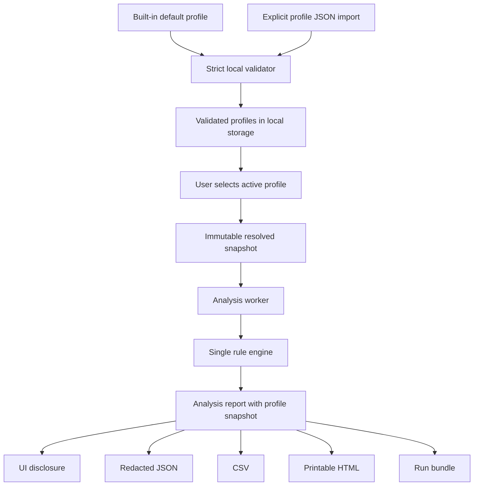

# Phase 8E: Threshold Profiles and Optimizer/Compile Qualification

## Summary

Phase 8E should introduce strict, versioned, local threshold profiles while preserving the published behavior as the built-in default. Every new analysis should carry an immutable snapshot of the resolved profile, and every output should disclose that snapshot consistently. Compile and optimizer attributes should initially qualify the interpretation of existing findings only; they should not create findings, raise severity, or change confidence grades without workload-aware evidence and a deliberately versioned policy.

This document distinguishes **repository evidence** from **recommendations**. File references are repo-relative and line numbers describe the repository state reviewed on 2026-08-29.

---

## Problem Statement

The rule engine currently reads one compiled threshold catalog (`src/rules/catalog.ts:1-7`), but several additional numeric cutoffs that affect finding presence, severity, or confidence remain inline in `src/rules/engine.ts`. There is no profile identity in `AnalysisReport`, no profile input to `RuleContext`, and no active-profile disclosure in reports or run archives (`src/types.ts:238-266`, `src/rules/engine.ts:605-661`, `src/lib/runBundle.ts:110-135`). This makes safe local calibration and exact result reproduction impossible.

Showplan parsing already retains compile time, compile CPU, compile memory, optimizer early-abort reason, and optimization level (`src/types.ts:93-112`, `src/lib/showplan.ts:154-161`). The current rule engine does not use those fields. Phase 8E therefore needs an explicit policy for their meaning before they influence output.

The design must preserve two established trust properties:

- Rule evaluation remains consolidated in one engine path rather than splitting default and custom-profile logic into separate evaluators (`src/rules/engine.ts:553-661`).
- Bounded finding families continue to report exact retained and suppressed counts in the UI and every export (`REMEDIATION-PLAN.md:189-204`, `src/rules/engine.ts:555-637`, `src/lib/report.ts:93-133`, `src/lib/runBundle.ts:121-135`).

### Non-goals

- No server-, database-, workload-, or vendor-specific presets are defined in Phase 8E. The repository contains no evidence from which to derive them.
- No cloud profile registry, sharing service, telemetry, automatic upload, SQL Server connection, or remote validation is added.
- No automatic tuning, remediation, or operational change is performed.
- Compile or optimizer attributes do not create new finding families in the initial implementation.
- Profiles do not change wait-family classification, negative blocking-owner semantics, evidence correlation rules, redaction, export authorization, finding caps, collection recipes, or Deep Analysis profile selection logic.
- Opening a saved report does not re-run it using the currently active profile.
- This design does not alter current application behavior by itself.

---

## Repository Evidence and Design Consequences

| Direct evidence | Consequence recommended for Phase 8E |
|---|---|
| `RULE_THRESHOLDS` contains blocking, resource, wait, transaction, estimate, missing-index, and grant cutoffs (`src/rules/catalog.ts:1-7`). | Make these values part of the built-in profile without changing their defaults. |
| Additional numeric decisions are inline: blocking victim count 2, resource minimum 30 seconds and Low threshold 60 seconds, worker thresholds 2/2, compile-pressure thresholds 3/4, and confidence recurrence cutoffs (`src/rules/engine.ts:262-264`, `src/rules/engine.ts:321-351`, `src/rules/engine.ts:380-401`, `src/rules/engine.ts:418-436`). | Move all numeric diagnostic decisions into the same resolved profile so a profile is complete and auditable. |
| Caps are centralized separately as 20/24/20, and cap metadata is disclosed (`src/rules/engine.ts:555-637`). | Keep caps fixed and outside profiles. Calibration must not weaken bounded rendering or disclosure. |
| The engine returns report schema `1.0`, and the validator currently accepts only `1.0` while allowing newer optional fields inside that shape (`src/rules/engine.ts:661`, `src/lib/report.ts:136-173`). | Add optional profile metadata to report schema `1.0` for backward compatibility; require it on newly generated reports in application logic. |
| Default JSON, CSV, printable HTML, and report-derived run-archive outputs pass through redaction unless raw export is explicitly authorized (`README.md:49-64`, `src/App.tsx:198-215`, `src/lib/report.ts:52-76`, `src/lib/runBundle.ts:90-94`, `src/lib/runBundle.ts:129-139`). The run manifest and processing log are built separately and currently retain source names, sizes, hashes, warnings, and errors (`src/lib/runBundle.ts:97-128`). | Profile disclosure must pass through the report export functions and must never carry source SQL or diagnostic payloads. Privacy tests must cover manifest/log metadata separately rather than assuming `redactReport` processes it. |
| CASE-006 explicitly asserts a High `PLAN-MEMORY-GRANT` under the published thresholds (`src/blinded-fixtures.integration.test.ts:49-52`). Its plan reports 786,432 KB granted and 41,216 KB maximum used (`fixtures/CASE-006/plan_CASE-006_a.sqlplan:8-9`). | The built-in profile must retain the 512 MiB unused-grant and 8x ratio High cutoffs. |
| All five compile/optimizer fields are parsed, while current parser tests directly assert only early-abort reason and compile CPU (`src/lib/showplan.ts:155-160`, `src/lib/showplan.test.ts:70-78`). No rule-engine path uses the fields (`src/rules/engine.ts:493-545`). | Add parser coverage for all five, then treat them as bounded, correlated qualification context rather than independent diagnostic assertions. |

---

## Key Design Decisions

### One resolved profile per analysis

The analyzer should accept a fully validated `ThresholdProfile`, resolve it once before rule execution, and put the same immutable snapshot on the resulting report. Rules must read `context.thresholds`; they must not consult browser storage or branch between a legacy and profile-aware evaluator. This preserves rule-engine consolidation and makes tests deterministic.

### Complete numeric calibration, fixed semantic safety

Every numeric cutoff that changes whether a diagnostic finding exists, its severity, or its confidence is configurable. Semantic and safety rules remain code invariants. A profile can calibrate evidence magnitude; it cannot redefine what counts as evidence, disable disclosure, or turn an advisory observation into a causal claim.

### Saved results describe their historical profile

Profile selection affects the next analysis only. Changing the active profile does not mutate a report already on screen. A newly analyzed report stores the exact resolved values and a digest, so later profile edits cannot change the meaning of saved output.

### Compile and optimizer data are qualifiers in v1

The five already-parsed attributes may be attached only to a plan-native finding produced from the same `plan.id` and `statement.id`. Activity findings can reach that context through the existing related-finding link; v1 does not attach standalone-plan metadata directly to an activity finding because the core `WhoIsActiveRecord` model has no structured query identity. Their presence proves only that the plan reported the attribute. In v1 they do not create findings, change severity, or change the `High`/`Medium`/`Low` confidence grade.

---

## Proposed Threshold-Profile Schema

The profile is a standalone JSON document. Its schema is versioned independently from report and run-manifest schemas.

```json
{
  "schemaVersion": "1.0",
  "id": "builtin.default",
  "version": "1.0.0",
  "name": "SQL Evaluate published defaults",
  "description": "Preserves SQL Evaluate 1.3.0 diagnostic behavior.",
  "thresholds": {
    "blocking": {
      "mediumVictims": 2,
      "highVictims": 5,
      "mediumPersistenceSeconds": 15,
      "highPersistenceSeconds": 60,
      "transientVictimWaitMs": 1000
    },
    "resources": {
      "minimumDurationSeconds": 30,
      "lowDurationSeconds": 60,
      "mediumDurationSeconds": 300,
      "highDurationSeconds": 900,
      "mediumPercentile": 0.9,
      "highPercentile": 0.95,
      "lowRepeatedCaptures": 3,
      "mediumConfidenceCaptures": 2
    },
    "waits": {
      "actionableDurationMs": 1000,
      "highPersistenceSeconds": 60,
      "corroboratingCaptures": 2,
      "mediumConfidenceObservations": 2
    },
    "workerExhaustion": {
      "highCaptures": 2,
      "highConcurrency": 2,
      "highConfidenceCaptures": 2
    },
    "compilePressure": {
      "highCaptures": 3,
      "highConcurrency": 4,
      "highConfidenceCaptures": 2,
      "highConfidenceVariants": 2
    },
    "transactions": {
      "mediumAgeSeconds": 300,
      "highAgeSeconds": 900
    },
    "plans": {
      "mediumEstimateRatio": 10,
      "highEstimateRatio": 100,
      "mediumRows": 10000,
      "highRows": 100000,
      "mediumMissingIndexImpact": 70,
      "mediumGrantWasteKb": 131072,
      "highGrantWasteKb": 524288,
      "mediumGrantRatio": 4,
      "highGrantRatio": 8
    }
  }
}
```

The default values reproduce both `src/rules/catalog.ts:1-7` and the inline numeric rule behavior identified above. The implementation should expose one frozen `DEFAULT_THRESHOLD_PROFILE` and derive rule-definition threshold displays from it. There must not be a second hand-maintained default object.

### Top-level field validation

| Field | Required validation |
|---|---|
| `schemaVersion` | Required string; exactly `"1.0"`. Unknown versions are rejected, never partially interpreted. |
| `id` | Required string; 1-64 characters; pattern `^[a-z0-9][a-z0-9._-]{0,63}$`. `builtin.*` is reserved and cannot be imported or overwritten. |
| `version` | Required string; strict `MAJOR.MINOR.PATCH` with non-negative decimal integers and no prerelease/build suffix. Changes to the canonical audit payload require a version change. |
| `name` | Required trimmed string; 1-80 Unicode characters; no control characters or line breaks. The UI warns that it appears in exports. |
| `description` | Required string; 0-500 Unicode characters; line breaks allowed; no other control characters. It is shown in profile management and profile-file export, but omitted from default report and run outputs. |
| `thresholds` | Required object containing exactly the seven groups and every field shown above. Arrays, `null`, inherited properties, and unknown keys at any level are rejected. |

All numeric values must be JSON numbers, finite, and safe integers where the table says integer. Numeric strings, `NaN`, infinities, coercion, missing fields, and partial profiles are rejected. Validation produces field-addressed errors and applies the profile atomically; it never clamps, fills, or partially merges values.

### Threshold field validation and defaults

| Field(s) | Default | Field validation |
|---|---:|---|
| `blocking.mediumVictims` | 2 | Integer, `>= 1`, and `<= highVictims`. |
| `blocking.highVictims` | 5 | Integer, `>= mediumVictims`. |
| `blocking.mediumPersistenceSeconds` | 15 | Integer, `>= 0`, and `<= highPersistenceSeconds`. |
| `blocking.highPersistenceSeconds` | 60 | Integer, `>= mediumPersistenceSeconds`. |
| `blocking.transientVictimWaitMs` | 1,000 | Integer, `>= 0`. This preserves the current blocking-specific use of the wait cutoff without coupling future blocking calibration to generic wait calibration. |
| `resources.minimumDurationSeconds` | 30 | Integer, `>= 0`, and `<= lowDurationSeconds`. |
| `resources.lowDurationSeconds` | 60 | Integer, `>= minimumDurationSeconds`, and `<= mediumDurationSeconds`. |
| `resources.mediumDurationSeconds` | 300 | Integer, `>= lowDurationSeconds`, and `<= highDurationSeconds`. |
| `resources.highDurationSeconds` | 900 | Integer, `>= mediumDurationSeconds`. |
| `resources.mediumPercentile` | 0.9 | Finite number, `> 0`, `<= 1`, and `<= highPercentile`. |
| `resources.highPercentile` | 0.95 | Finite number, `>= mediumPercentile`, and `<= 1`. |
| `resources.lowRepeatedCaptures` | 3 | Integer, `>= 2`. |
| `resources.mediumConfidenceCaptures` | 2 | Integer, `>= 2`. |
| `waits.actionableDurationMs` | 1000 | Integer, `>= 0`. |
| `waits.highPersistenceSeconds` | 60 | Integer, `>= 0`. |
| `waits.corroboratingCaptures` | 2 | Integer, `>= 2`. |
| `waits.mediumConfidenceObservations` | 2 | Integer, `>= 2`. |
| `workerExhaustion.highCaptures` | 2 | Integer, `>= 2`. |
| `workerExhaustion.highConcurrency` | 2 | Integer, `>= 2`. |
| `workerExhaustion.highConfidenceCaptures` | 2 | Integer, `>= 2`. |
| `compilePressure.highCaptures` | 3 | Integer, `>= 2`. |
| `compilePressure.highConcurrency` | 4 | Integer, `>= 2`. |
| `compilePressure.highConfidenceCaptures` | 2 | Integer, `>= 2`. |
| `compilePressure.highConfidenceVariants` | 2 | Integer, `>= 2`. |
| `transactions.mediumAgeSeconds` | 300 | Integer, `>= 0`, and `<= highAgeSeconds`. |
| `transactions.highAgeSeconds` | 900 | Integer, `>= mediumAgeSeconds`. |
| `plans.mediumEstimateRatio` | 10 | Finite number, `>= 1`, and `<= highEstimateRatio`. |
| `plans.highEstimateRatio` | 100 | Finite number, `>= mediumEstimateRatio`. |
| `plans.mediumRows` | 10,000 | Integer, `>= 1`, and `<= highRows`. |
| `plans.highRows` | 100,000 | Integer, `>= mediumRows`. |
| `plans.mediumMissingIndexImpact` | 70 | Finite number, `>= 0`, and `<= 100`; the bound validates the repository's percentage-shaped field, not a new SQL Server claim. |
| `plans.mediumGrantWasteKb` | 131,072 | Integer, `>= 0`, and `<= highGrantWasteKb`. |
| `plans.highGrantWasteKb` | 524,288 | Integer, `>= mediumGrantWasteKb`. |
| `plans.mediumGrantRatio` | 4 | Finite number, `>= 1`, and `<= highGrantRatio`. |
| `plans.highGrantRatio` | 8 | Finite number, `>= mediumGrantRatio`. |

Every integer is additionally limited to `Number.MAX_SAFE_INTEGER`. A later product decision may add narrower usability bounds, but the application must not invent operationally “safe” SQL Server maxima without evidence.

### Version and identity rules

- `schemaVersion` changes only when the profile document's structure or validation semantics become incompatible.
- `version` changes whenever values or meaning change under the same `id`. Threshold-only compatible changes increment at least PATCH; changing a field's diagnostic meaning requires a new MAJOR version.
- `description` is non-normative local documentation and is excluded from identity. Importing an otherwise identical `id`/version with a different description preserves the already stored description unless the user explicitly confirms a metadata-only replacement.
- The built-in profile is immutable. A user edits it only by cloning to a non-reserved `id` with version `1.0.0`.
- Construct a new plain audit object in the exact schema order shown in this document: `schemaVersion`, `id`, `version`, `name`, then all threshold groups and fields in their declared order. Serialize it with compact `JSON.stringify` (no replacer or spacing), encode that string as UTF-8 with `TextEncoder`, and represent the SHA-256 result as 64 lowercase hexadecimal characters. Exclude `description` because report snapshots intentionally omit it. A duplicate `id` plus `version` is accepted only when this audit digest matches; a conflicting digest is rejected.
- The digest is an integrity/reproducibility identifier, not a signature or source-authentication claim.

---

## Configurable Thresholds and Fixed Invariants

### Configurable

All fields under `thresholds` are configurable because each is a numeric calibration decision that already changes finding inclusion, severity, or confidence. Moving the inline values into the profile prevents hidden calibration outside the disclosed snapshot. Rule text that states a threshold or suppression boundary must interpolate the resolved value rather than retain a hard-coded number.

### Fixed safety and interpretation invariants

The following remain code-owned and are not profile fields:

- Finding caps, cap order, exact suppressed counts, and cap disclosure. Current cap counts remain 20 for `WIA-RESOURCE`, 24 for `WIA-WAIT`, and 20 for `WIA-TRANSACTION` unless separately reviewed as a bounded-rendering change.
- One consolidated worker-exhaustion finding and one consolidated compile-pressure finding per grouped incident. Profiles must not restore one-finding-per-row noise.
- Severity and confidence enums, their display order, and the separation between severity and confidence.
- Required-column gates, `Not Evaluated` behavior, null handling, finite-number checks, actual-versus-estimated plan requirements, and the prohibition on treating missing evidence as zero.
- Wait-family classification, the special treatment of `THREADPOOL` and `RESOURCE_SEMAPHORE_QUERY_COMPILE`, benign/parallel contextual handling, negative blocking-owner meanings, sleeping-open-transaction logic, and direct Showplan evidence requirements.
- Stable-identity and incident-window correlation requirements. Similar SQL text alone never makes plan evidence causal, consistent with `README.md:34-36`.
- Finding-cap limits, five related-finding links, five displayed victim SPIDs, and 72 timeline points. These are bounded rendering/data-shape limits rather than diagnostic calibration (`src/rules/engine.ts:38`, `src/rules/engine.ts:73-77`, `src/rules/engine.ts:600`). A v1 plan-native finding can receive at most the five unique qualifier kinds from its single source statement, so it requires no second cap or suppression system.
- Redaction fields, formula neutralization, safe external URL schemes, HTML escaping, source-file size limits, raw-export confirmation, and ZIP path sanitization.
- Deep Analysis profile IDs and routing. A threshold profile may change which findings exist, but it cannot directly select or rename a Deep Analysis workflow.
- The rule engine remains the only component that converts normalized evidence plus a resolved profile into findings. UI and exporters must not recalculate severity.

---

## Profile Lifecycle and State/Data Flow



### Selection and local storage

- Add a profile selector near the analysis/import control, plus a read-only badge in report metadata.
- Store validated custom profiles under a namespaced local-storage key such as `sql-evaluate.threshold-profiles.v1` and the active `{id, version, digest}` under `sql-evaluate.active-threshold-profile.v1`.
- Local storage contains profile documents only. It must never contain captures, plans, normalized records, findings, report JSON, source file names, or Deep Analysis evidence.
- On startup, validate each stored profile before use. If storage is unavailable, malformed, or over quota, continue with the built-in default and show a non-blocking local-storage warning.
- If the active reference is missing, invalid, or no longer resolves exactly, activate the built-in default and disclose the fallback. Never choose “the latest” custom version implicitly.
- A selection change applies to subsequent analyses. If source files for the current report are still available, the UI may offer an explicit **Re-analyze with selected profile** action; it must not re-analyze automatically. Imported saved reports are historical and cannot be reinterpreted without their original source inputs.

### Import and export

- Profile import is a separate, explicit local file action for one JSON profile. Reject files larger than 64 KiB before reading or parsing; then reject unknown schema versions and unknown keys, compute the digest, and show a summary before the user stores it.
- Import never activates a profile automatically and never imports a profile embedded in a report or run bundle into the local profile library.
- Profile export writes only the validated profile document. It contains no report, SQL, source file, diagnostic evidence, local-storage key, or usage history.
- The built-in default may be exported for audit, but it cannot be overwritten or deleted.

### Disclosure by surface

| Surface | Required disclosure |
|---|---|
| UI before analysis | Active profile name, `id`, version, and whether it is built-in or custom; access to view exact values. |
| UI after analysis | Report profile name, `id`, version, digest prefix, and a warning if it differs from the currently selected profile. The quality/audit view lists the exact resolved values. |
| JSON report | Optional `thresholdProfile` snapshot for backward compatibility; always present on newly generated reports. Include `schemaVersion`, `id`, `version`, `name`, full thresholds, and full digest. Omit description. |
| CSV | Change the exporter boundary to `findingsCsv(report: AnalysisReport)` so it cannot lose report-level provenance. Add `Threshold profile`, `Threshold profile version`, and `Threshold profile digest` columns to every row and always emit one `THRESHOLD-PROFILE` audit row, even when there are no findings or cap disclosures. For a legacy report, that row says `Not recorded` with blank version/digest. Exact values remain in JSON and the run manifest rather than being duplicated into every CSV row. |
| Printable HTML | Add a header/audit block with name, `id`, version, digest, built-in/custom status, and a compact table of exact resolved thresholds. Escape all text. |
| Run bundle manifest | Add the profile identity, version, digest, and built-in/custom status. Keep full values in `results/analysis.sqleval.json`; also include them in `diagnostics/processing-log.json` so cap and calibration audit data remain together. |
| Run-bundle CSV and HTML | Generated from the report snapshot, not the currently selected local profile, and therefore identical to standalone export disclosure. |

Profile disclosure is report-level metadata. It must not be synthesized as a finding or consume a finding-cap slot.

---

## Backward Compatibility and Migration

### Existing reports

`AnalysisReport.schemaVersion` remains `"1.0"` for this additive change. `thresholdProfile` is optional in the TypeScript type and validator so existing `.sqleval.json` reports continue to import, matching the existing optional-field precedent for timelines and finding caps (`src/lib/report.test.ts:61-73`).

When profile metadata is absent:

- Preserve findings exactly as saved; do not re-run or re-grade them.
- Display and export `Legacy report — threshold profile not recorded`.
- Do not claim the report used the current built-in default. Older reports could have come from another application build, so that inference is not evidence-backed.
- Redaction and validation continue to apply normally.

Newly generated reports always contain a complete profile snapshot. Import is a two-step boundary: synchronous `validateReportShape` validates the report and profile structure, then asynchronous `verifyThresholdProfileDigest` uses Web Crypto before the report becomes active. Invalid present metadata or a digest mismatch makes the report incompatible; it must not be discarded while the findings are silently accepted, because that would break provenance. Legacy reports without a snapshot complete the structural step and explicitly skip digest verification.

### Existing run bundles

Keep run-manifest schema `"1.0"` and add optional profile summary fields. Old ZIP files remain ordinary archives, and their `results/analysis.sqleval.json` remains importable. No archive rewrite or migration is required. Consumers must treat an absent manifest/report profile as `Not recorded`, not as default.

### Stored profiles across application upgrades

- Revalidate stored profiles on every startup against their declared profile schema.
- Retain supported older schemas unchanged and resolve through an explicit pure migration function only when a later implementation actually defines one.
- Never auto-migrate an unknown newer schema or overwrite the original stored JSON.
- If a future built-in default changes, publish a new built-in profile version and retain older built-in versions while saved reports or stored active references may still identify them. A default threshold change is a product release decision, not silent data migration.

---

## Optimizer and Compile Qualification Policy

### Direct evidence boundary

The repository establishes only that Showplan supplies the five attributes and that the parser retains them. It does not establish universal “bad” values, workload-normal ranges, or a causal mapping from a token/value to an existing finding. Phase 8E must not invent those SQL Server facts.

Add an optional structured qualification to findings rather than appending ambiguous prose:

```ts
interface FindingQualification {
  kind: "Compile time" | "Compile CPU" | "Compile memory" | "Optimizer early abort" | "Optimization level";
  disposition: "Observed" | "Context only";
  value: string;
  reason: string;
  planId: string;
  statementId: string;
}
```

`Finding.qualifications?: FindingQualification[]` is allowed only on plan-native findings, contains at most one entry of each kind and five entries total, and is sorted in the kind order above. Every entry must reference the one `plan.id` and `statement.id` that produced the finding. The report validator must validate every field, membership in the closed enums, referenced IDs, uniqueness, and string lengths. `reason` is limited to 500 characters; IDs and `value` are limited to 128 characters with control characters rejected. The five-kind structural maximum is validated, not truncated, so no qualification suppression metadata is needed.

Qualifications require explicit redaction code; existing `redactFinding` does not process this new field. They must not include statement text, object names, predicates, handles, hashes, parameter values, XML, or arbitrary raw attribute content.

### Attribute-by-attribute behavior

| Attribute | v1 qualification behavior | Finding/severity/confidence behavior |
|---|---|---|
| Compile time | Show the reported millisecond value as `Context only` on a plan-native finding from the same statement. No universal threshold is added. | No new finding; no severity change; no confidence-grade change. |
| Compile CPU | Show the reported millisecond value as `Context only` on a plan-native finding from the same statement. Do not infer CPU pressure from magnitude alone. | No new finding; no severity change; no confidence-grade change. |
| Compile memory | Show the reported KB value as `Context only` on a plan-native finding from the same statement. Keep it explicitly separate from execution workspace grants and `PLAN-MEMORY-GRANT`, consistent with the engine's existing distinction at `src/rules/engine.ts:399-402`. | No new finding; must not qualify or escalate execution memory-grant findings; no confidence-grade change. |
| Optimizer early-abort reason | Record a display-safe Showplan token as `Observed`. Accept 1-128 characters matching `^[A-Za-z0-9_.:-]+$`; otherwise use `[redacted optimizer value]` in default exports and qualifications. Unless a later rule-specific mapping is supported by tests and references, state that causal significance was not evaluated. | No new finding; no severity change; no confidence-grade change. It may add a limitation to causal narratives. |
| Optimization level | Record a display-safe token under the same policy as `earlyAbortReason`; otherwise redact it in default exports. Do not rank or interpret values without an approved mapping. | No new finding; no severity change; no confidence-grade change. |

These attributes “qualify confidence” by making the basis and limitations of an existing finding more explicit. Direct presence gives High confidence that the metadata itself was observed; it does not transfer High confidence to a causal diagnosis. Missing attributes do not lower unrelated findings and do not create `Not Evaluated` findings.

### Correlation and deduplication

- A plan-native finding may receive qualifiers only from its own `plan.id` and `statement.id`.
- Activity findings receive no direct plan qualifiers in v1. When an embedded plan comes from an affected activity row, the existing related-finding relationship leads to the qualified plan finding without copying its context.
- Standalone-plan-to-activity qualification is deferred. Supporting it later requires structured query identity on the core activity model plus stable-identity and incident-window correlation; similar SQL text, matching titles, or the mere presence of a plan in the same upload remains insufficient.
- Repeated identical attributes on the same statement produce one qualifier. Conflicting values remain separate on their respective statement findings; they are not averaged or forced into one conclusion.
- Qualifiers are applied before related-finding enrichment and final sorting, but they do not alter `impact`, finding sort order, cap accounting, or Deep Analysis routing.

### Gate for later severity or confidence changes

A later profile-schema version may add compile thresholds or token policies only after all of the following exist:

1. Workload-aware fixtures containing normal and problematic counterexamples.
2. An approved product/DBA interpretation for each value or token.
3. A rule-specific causal mapping and minimum correlation requirements.
4. Tests proving no new finding spam, no execution/compile-memory conflation, and stable cap disclosure.
5. A deliberately versioned built-in profile change with release-note disclosure.

---

## CASE-006 Compatibility Contract

The default profile must preserve the existing High `PLAN-MEMORY-GRANT` result required by `src/blinded-fixtures.integration.test.ts:49-52` and `REMEDIATION-PLAN.md:227-229`.

CASE-006 reports 786,432 KB granted and 41,216 KB maximum used, yielding 745,216 KB unused and an approximately 19.1x grant/use ratio. Both exceed the published High defaults of 524,288 KB unused and 8x (`fixtures/CASE-006/plan_CASE-006_a.sqlplan:8-9`, `src/rules/catalog.ts:6`, `src/rules/engine.ts:534-539`). Therefore:

- `builtin.default@1.0.0` must produce a High memory-grant finding for CASE-006.
- Compile memory of 4,096 KB is qualification context only and must not be confused with, offset, or replace the execution grant (`fixtures/CASE-006/plan_CASE-006_a.sqlplan:8`).
- A custom profile may produce a different result, but the report must disclose that custom profile.
- Any change to the built-in result requires a new built-in profile version, an intentional product/DBA decision, updated fixture expectations, and release-note disclosure. It must never result from schema migration, rounding, unit conversion, or fallback behavior.

---

## Privacy and Security Constraints

- Operation remains local-only on `127.0.0.1`, with no telemetry, upload, analytics, remote profile lookup, or SQL Server connection, preserving `README.md:7-13`, `README.md:49-64`, and `RELEASE_NOTES.md:25-31`.
- Profile storage contains configuration only. Profile import/export cannot read from or embed the active report, source files, raw SQL, plan XML, normalized activity, findings, diagnostic commands, handles, hashes, identities, or file names.
- Default report and report-derived run outputs retain the existing redaction boundary. Adding profile metadata or qualifications must not reintroduce statement text, plan literals, object/predicate expressions, database, host, login, program, parameters, identifiers, raw diagnostic payloads, or source files. The manifest and processing log require separate assertions because they intentionally retain source names and processing metadata today.
- Raw source and raw diagnostic detail remain available only through the existing explicit, warning-backed **Include raw details** authorization. Profile selection cannot enable it.
- Profile names and descriptions are user-authored metadata. The UI must warn that names are disclosed; descriptions are omitted from report/run outputs. Neither field is interpolated into HTML without escaping or into CSV without formula neutralization.
- Imported JSON is untrusted: enforce the 64 KiB profile-file limit before reading, parse once, validate exact own properties, reject prototype-polluting/unknown keys, and never execute or render embedded markup.
- Digests use the browser's local cryptographic API and are never sent elsewhere. A digest verifies exact content identity only.
- Profile failures must not expose input contents in error messages or logs.

---

## Phased Implementation Plan

### Phase 1: Profile domain, defaults, and validation

**Likely files:** `src/types.ts`, `src/rules/catalog.ts`, new `src/rules/thresholdProfiles.ts`, and new profile unit tests.

**Work:** Define the profile, resolved snapshot, and finding-qualification types. Move every numeric diagnostic cutoff from `RULE_THRESHOLDS` and inline rule logic into one frozen default profile. Remove the value-bearing `RuleDefinition.thresholds` property or replace it with threshold-key references so rule metadata cannot retain a stale default snapshot. Implement strict validation, the exact ordered UTF-8 canonical serialization above, asynchronous SHA-256 digesting, reserved-ID handling, and exact duplicate/conflict behavior. Keep references separate from profile data.

**Tests:** Every field's valid boundary and invalid type/range; every cross-field ordering rule; missing and unknown keys; 64 KiB import boundary; reserved IDs; unknown schema; canonical byte-string and digest stability; duplicate identity with matching and conflicting digests; default object immutability; no value-bearing threshold copy remains in rule definitions.

**Failure behavior:** A bad imported profile is rejected atomically with field-addressed errors. A bad persisted profile is quarantined from selection, the default is activated, and a local warning is displayed.

**Acceptance:** A single exported constant reproduces every current numeric rule decision; no diagnostic number affecting presence/severity/confidence remains hidden inline or copied into rule metadata; `builtin.default@1.0.0` validates and has a stable canonical byte fixture and digest.

### Phase 2: Engine injection and regression parity

**Likely files:** `src/types.ts`, `src/rules/engine.ts`, `src/lib/processFiles.ts`, `src/analysis.worker.ts`, `src/rules/engine.test.ts`, `src/lib/processFiles.test.ts`, `src/synthetic-fixture.integration.test.ts`, and `src/blinded-fixtures.integration.test.ts`.

**State/data flow:** `App` resolves the active profile, sends the snapshot with files to the worker, `processInputFiles` passes it to `analyze`, and `analyze` puts it in `RuleContext` and the final report. Test-only analyzer injection remains possible with an updated typed signature.

**Work:** Replace all catalog and inline numeric reads with `context.thresholds`. Keep rule grouping, capping, enrichment, sorting, and Deep Analysis routing on the existing single path. Generate threshold/suppression explanation text from resolved values.

**Tests:** Default-profile parity for all engine tests; threshold boundary tests immediately below/at/above every cutoff; cross-rule isolation; custom-profile changes limited to intended findings; unchanged cap counts/order/disclosure; deterministic worker transfer; CASE-001 quietness and all blinded regressions.

**Failure behavior:** Analysis never starts with an unresolved profile. If worker profile validation fails, return a profile-specific analysis error and no partial report; UI may retry explicitly with the built-in default.

**Acceptance:** The full existing suite passes unchanged under the default profile; CASE-006 remains High; custom profiles use the same evaluator; finding caps and exact suppressed counts are unchanged.

### Phase 3: Local profile management and UI disclosure

**Likely files:** `src/App.tsx`, `src/styles.css`, new profile-management components if needed, `src/App.test.tsx`, and profile storage tests.

**Work:** Load and validate the local profile library, select an active exact version, clone built-in defaults, explicitly import/export JSON, delete only custom profiles, and show active-versus-report profile metadata. Keep current report state immutable when selection changes.

**Tests:** Empty/unavailable/corrupt/quota-exceeded local storage; activation persistence; unknown active reference fallback; import preview and non-activation; reserved-ID and collision rejection; profile deletion fallback; keyboard and mobile accessibility; selection change does not mutate the current report; no report/source data written to local storage.

**Failure behavior:** Storage failure is non-fatal and defaults locally. Import errors do not alter storage or selection. Deleting the active custom profile explicitly switches to default after confirmation.

**Acceptance:** A user can identify the profile before analysis, reproduce an exact local profile through export/import, and distinguish the profile on a historical report from the profile selected for the next run.

### Phase 4: Report, export, bundle, and migration disclosure

**Likely files:** `src/types.ts`, `src/lib/report.ts`, `src/lib/runBundle.ts`, `src/App.tsx`, `src/lib/report.test.ts`, `src/lib/runBundle.test.ts`, and `src/App.test.tsx`.

**Work:** Split report import into synchronous shape validation and asynchronous profile-digest verification. Add optional report profile validation, report-level UI/audit disclosure, a report-based `findingsCsv(report)` API with its mandatory profile audit row, printable HTML profile block, run-manifest summary, and processing-log snapshot. Always render from the report snapshot. Preserve formula neutralization, escaping, safe links, redaction, and cap rows. Define explicitly which manifest/log metadata remains intentionally present; do not describe those files as outputs of `redactReport`.

**Tests:** New and legacy report import; synchronous shape failure; asynchronous digest mismatch; invalid present snapshot; redacted/raw JSON; CSV profile audit row with zero findings and with cap rows; formula-like profile names; escaped printable HTML; standalone versus bundled output equality; old manifest absence; default ZIP excludes source bytes and sensitive report-derived fields; explicit assertions for the source names/hashes and processing metadata that manifests/logs retain; raw authorization behavior unchanged.

**Failure behavior:** An invalid profile snapshot in an imported new report rejects the report as incompatible. A legacy report without one opens with `Not recorded`. Export refuses if a supposedly new in-memory report lacks its required resolved snapshot rather than substituting the current profile.

**Acceptance:** UI, JSON, CSV, printable HTML, manifest, processing log, and bundled JSON/CSV/HTML disclose one consistent identity and digest; cap disclosure remains identical across surfaces; legacy reports and bundles remain usable.

### Phase 5: Compile/optimizer qualifications

**Likely files:** `src/types.ts`, `src/rules/engine.ts`, `src/lib/showplan.ts`, `src/lib/report.ts`, `src/components/FindingDrawer.tsx`, `src/rules/engine.test.ts`, `src/lib/report.test.ts`, `src/lib/showplan.test.ts`, and fixture integration tests. Core activity normalization and Deep Analysis correlation files are deliberately excluded from v1.

**Work:** Tighten Showplan parsing for these attributes, build at most five structured qualifications on each plan-native finding from its own statement, add explicit report-import validation and default-export redaction, and expose safe values in finding detail and exports. Activity findings use existing related-finding links rather than copied qualifiers. Keep qualifications out of impact, finding sorting, caps, severity, confidence grade, and Deep Analysis routing.

**Tests:** All five parsed attributes present/absent; malformed and non-finite numerics; safe and unsafe strings; optional PlanStatement-field validation on report import; actual and estimated plans; same-statement plan finding; no direct qualifier on activity findings; embedded-plan related finding retains the navigation path; similar SQL text is insufficient; duplicate and conflicting statements; five-kind uniqueness/maximum validation; compile memory never affects `PLAN-MEMORY-GRANT`; active-content escaping and default-export privacy; no new findings or severity/count changes across all fixtures.

**Failure behavior:** Current Showplan numeric parsing is permissive and does not warn (`src/lib/showplan.ts:34-35`, `src/lib/showplan.ts:185-193`, `src/lib/utils.ts:13-28`), so Phase 5 must explicitly make malformed or non-finite compile numerics absent and add an input warning. Unsafe optimizer strings use the default-export redaction placeholder and never flow verbatim into qualifications. Activity findings never receive best-effort standalone-plan attachment.

**Acceptance:** The five attributes are visible as scoped context where justified, all existing finding counts/severities/confidence grades remain stable under the default, and CASE-006 still produces its current High grant result.

### Phase 6: Verification and release gate

**Likely commands:** `npm test`, `npm run build`, and `npm audit`, followed by production-browser checks at desktop and 390x844 dimensions.

**Acceptance criteria:**

1. All existing tests plus the profile, migration, disclosure, privacy, and qualification matrices pass.
2. The built-in profile produces fixture output identical to the pre-8E baseline, including CASE-006 High.
3. At least one synthetic custom profile demonstrates each configurable group without bypassing invariant behavior.
4. No cap, retained/suppressed count, ordering, or cap-disclosure regression occurs.
5. Default standalone and bundled exports contain no newly leaked raw SQL, plan expressions, identifiers, source diagnostic payloads, or source files.
6. Corrupt/unsupported profile state cannot cause partial calibration or silent fallback without disclosure.
7. Browser UI is keyboard accessible, has no console errors, and has no horizontal overflow at the existing desktop/mobile verification sizes.
8. Release notes identify the built-in profile ID/version/digest and state whether any built-in value changed.

---

## Highest-Risk Implementation Areas

1. **Default parity:** numeric decisions are split between `src/rules/catalog.ts` and inline engine logic. Missing one would make the disclosed profile incomplete or cause a silent behavior change.
2. **Historical provenance:** substituting the current default for absent or invalid saved-report metadata would misstate how old findings were produced.
3. **Worker/state races:** selection may change while files are being processed. The worker must receive one immutable snapshot, and the report must use that snapshot rather than reading current UI state at completion.
4. **Correlation scope creep:** the current compile-pressure finding can reference supplied uncached plans broadly (`src/rules/engine.ts:397-407`), but the core activity model cannot establish statement identity. V1 must keep qualifiers on same-statement plan findings and must not reuse those broad affected-plan IDs as a correlation shortcut.
5. **Compile/execution memory conflation:** `CompileMemory` and execution `MemoryGrantInfo` are both measured in KB but support different existing narratives. Shared units must not produce shared thresholds or findings.
6. **Cross-format drift:** CSV, printable HTML, standalone JSON, bundle manifest, processing log, and bundled outputs must all use the report snapshot while preserving cap disclosure and redaction.
7. **Untrusted local JSON:** permissive merging, coercion, unknown keys, or profile-name rendering could enable silent misconfiguration, prototype pollution, formula injection, or active content.

---

## Open Questions Requiring Product or DBA Decision

1. **Custom-profile authority:** Who is allowed to author and approve profiles in the intended operating environment: any local user, only a DBA, or an organization-controlled process? This determines whether an “unapproved custom profile” warning is sufficient or whether signed/locked profiles are eventually needed.
2. **Usability bounds:** Should the editor impose narrower product-approved maximums beyond finite safe-number validation? The repository provides no evidence for operationally meaningful maxima.
3. **Built-in profile retention:** How many superseded built-in versions must ship for audit/reproduction, and for how long? The design recommends retaining any version referenced by supported saved reports, but product support policy is not stated.
4. **Qualification display:** Should compile/optimizer context appear by default in every eligible finding, or behind an “Optimizer and compile context” disclosure to avoid visual noise?
5. **Future confidence grading:** Which, if any, specific early-abort reasons, optimization levels, or workload-relative compile baselines are approved to raise or limit a finding's confidence grade? No such mapping is supported by current repository evidence.
6. **Future findings:** After workload-aware validation, should compile attributes ever create a separate informational finding, or remain context on `WIA-COMPILE-PRESSURE` and plan findings only? Phase 8E v1 recommends context only.
7. **Custom-profile fixture policy:** Must every approved organization profile have its own checked-in sanitized acceptance fixtures, or is a generic boundary-test matrix sufficient for non-built-in profiles?
