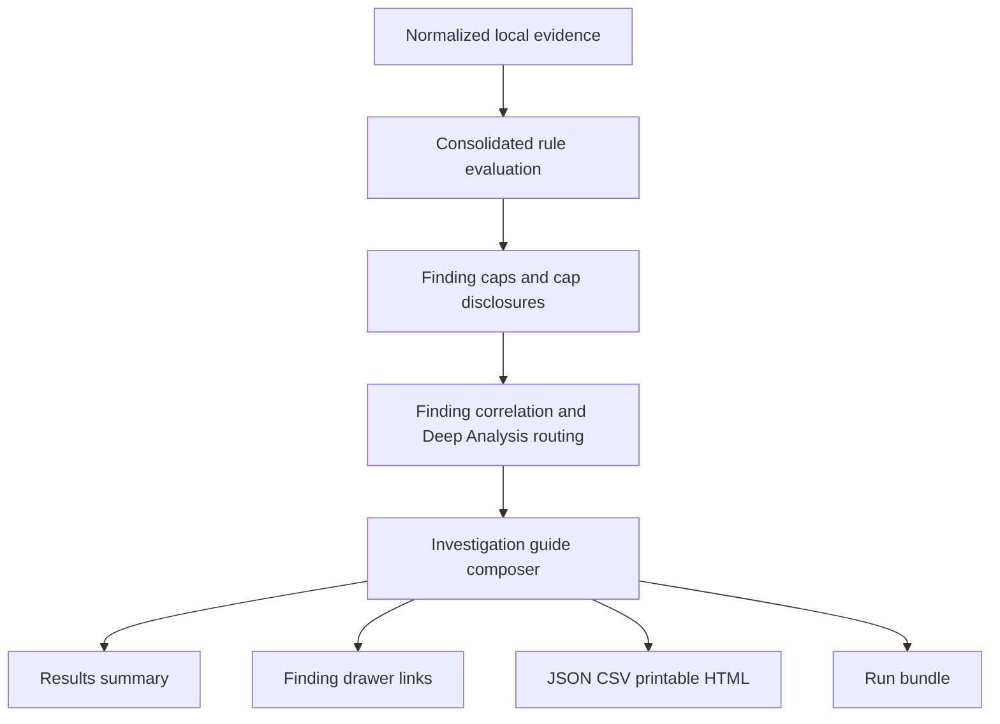

# Guided Investigation and Evidence-Clarity Plan

## Outcome

Add a prominent, numbered **Start investigation** guide that tells a DBA what the supplied evidence establishes, what remains unknown, and which safe next step is most likely to improve the diagnosis. The guide will compose existing findings, `nextCapture` recommendations, diagnostic tools, missing-evidence disclosures, and ready Deep Analysis profiles into one case-level path.

The feature will not create an independent diagnosis or override rule results. Rules remain consolidated in `src/rules/engine.ts`; the guide is derived only after findings have been evaluated, capped, related, and sorted. SQL Evaluate remains offline and never executes SQL, connects to a server, uploads evidence, or performs remediation.

The first implementation should also correct evidence wording exposed by the scrubbed Session 163 capture so the ordered guide does not amplify misleading labels.

Post-implementation review hardening preserves reported deltas without inventing their interval, groups guide subjects by request episode rather than SPID alone, fails open when guide composition cannot complete, neutralizes spreadsheet formulas in raw activity CSV, and labels unsupported imported Deep Analysis profiles as unavailable instead of exposing a dead action.

---

## Repository evidence

- Findings already carry `limitations`, `diagnosticTools`, `nextCapture`, `remediation`, related findings, affected evidence IDs, and an optional Deep Analysis profile in `src/types.ts`.
- Rule-specific capture recommendations and commands are created in `src/rules/engine.ts`, including resource-rate and plan capture, transaction ownership, wait-family context, and actual-plan acquisition.
- `src/components/FindingDrawer.tsx` displays this material for one selected finding, including copyable commands and a statement that SQL Evaluate never executes them.
- `src/deepAnalysis/profile.ts` routes supported findings to ready Deep Analysis profiles. TempDB and storage analysis remains explicitly planned, not ready.
- CSV and printable reports already serialize per-finding next-capture and diagnostic-tool guidance in `src/lib/report.ts`.
- The scrubbed Session 163 workbook is recognized as 303 records and currently produces High findings for sustained resource consumption, open transactions, `PAGEIOLATCH_SH`, and `IO_COMPLETION`. It intentionally cannot provide plan-level cause because `query_plan` was removed.

These are direct observations from the repository and the local workbook run. The behavior below is recommended design.

---

## Product decisions

### One case-level path

The results view should show one investigation summary above the finding list:

1. **What is established** — the highest-value correlated findings, with no new severity or confidence calculation.
2. **What is missing** — the evidence gap currently preventing a stronger causal conclusion.
3. **Best next step** — one primary action, followed by no more than four ordered follow-ups.
4. **Expected evidence** — what each step could confirm, contradict, or leave unresolved.
5. **Safety and privacy** — collection overhead, sensitive fields, and the fact that commands are never executed or uploaded.

For reports containing multiple sessions, add a compact per-session synopsis beneath the case conclusion. Each synopsis may state the last observed status, request duration, dominant measured counters, whether blocking was observed in the supplied evidence, and the most important missing evidence. It must say “no blocking observed” rather than “not blocking,” and “active at the last capture” rather than implying that a historical request is still active now.

The guide should use direct language such as “Upload an actual plan to evaluate operators and runtime warnings” rather than a generic “More data needed.” If an action depends on whether the incident is still active, the condition must be explicit.

### Deterministic priority

Order steps by diagnostic value rather than by finding-card order:

1. Correct malformed or insufficient input that prevents reliable evaluation.
2. Confirm an active availability risk such as blocking, worker exhaustion, or scheduler pressure.
3. Acquire the missing evidence most likely to identify cause, normally a short delta capture or a representative actual plan.
4. Corroborate server-level pressure for storage, memory, compilation, or CPU claims.
5. Investigate transaction ownership when open transactions persist or participate in blocking.

Do not recommend a broad server change, index creation, session termination, plan forcing, or Extended Events session as an initial step. Administrative or high-overhead escalation remains inside the appropriate Deep Analysis workflow with its existing warnings.

### Progressive disclosure

The results page shows the current conclusion and the first recommended step. Expanding the guide reveals later steps, expected evidence, cautions, copyable commands, and source findings. Finding drawers retain their detailed guidance and link back to the case-level step that references them.

### Export parity

The same ordered guide must be present in JSON, printable HTML, and run bundles. CSV should include a compact step number, title, action type, and source finding IDs without duplicating multiline commands into every finding row. Raw SQL, plan XML, diagnostic rows, database names, and object names remain excluded from default redacted exports.

---

## Evidence-semantics corrections

These corrections precede the guide because the guide must not present ambiguous measurements as conclusions.

### Capture-relative resource rank

Record the comparison population for every resource-rank point. When only one session is present in a capture, do not call it a “100th-percentile outlier.” Use **sustained resource consumer**, disclose that no peer workload was supplied, and base confidence on duration, repeated observations, and valid counter growth. Preserve the existing finding cap and cap disclosure.

Do not introduce universal CPU, reads, memory, or TempDB severity thresholds without repository evidence and a deliberately versioned threshold-profile change.

### Counter growth and rates

For repeated observations of the same episode, calculate non-negative growth and elapsed-time rates for CPU, reads, writes, physical reads, TempDB allocations, and current TempDB pages when timestamps and cumulative counters permit it. Treat decreases as counter resets or episode boundaries rather than negative consumption. Preserve supplied `*_delta` values as reported interval totals, but do not divide them by the time between capture rows unless the actual measurement interval is explicitly supplied. Continue showing the latest raw counter as context, clearly labeled cumulative when delta columns were not supplied.

CPU divided by elapsed time may be displayed as a descriptive ratio when both inputs are valid. A ratio above one can be labeled consistent with CPU accumulating across concurrent workers, but must not be called CPU-bound, parallel-plan proof, or instance CPU pressure without plan, task, scheduler, and workload evidence.

### Request age versus transaction age

Display request age and transaction age separately. A changing `tran_start_time` means the evidence does not establish one continuously open transaction across the full request. The finding may still report that a long-running request repeatedly had open transactions, but its summary and timeline must not substitute request age for transaction age.

Severity changes based on transaction age require explicit boundary tests. Until those tests are approved, preserve the current default severity while correcting labels and limitations.

### Wait observation span

Rename the first-to-last timestamp difference from an implied wait duration to **observation span**. Keep the maximum reported wait duration separate. Intermittent observations over several hours do not prove one continuous wait lasting several hours.

Collapse isolated, non-actionable wait observations into one **minor transient waits** summary instead of producing many separate cards. Preserve the raw local rows, total suppressed count, wait types, maximum duration, and cap disclosure so noise reduction does not hide evidence.

### Last-observed activity state

Show the final captured status and timestamp as **last observed**, not current state. When `percent_complete` is absent or null, say that completion progress was not supplied or is unavailable for this capture; do not estimate remaining time.

### Null and invalid wait tokens

Normalize blank and exported null sentinels in `wait_info` before parsing. A plain wait token must begin with a letter and must not be a numeric value, Boolean/transaction state such as `ON` or `OFF`, or a null sentinel. Rejected values remain available in original local activity data and produce one bounded input warning rather than fabricated wait findings.

---

## Proposed data flow

Introduce a report-owned guide rather than component-owned UI state. A likely model in `src/types.ts` is:

- `InvestigationGuide`: conclusion, missing-evidence summary, ordered steps, and generation version.
- `InvestigationSubjectSummary`: session/request identity, last-observed time and state, request duration, measured-resource summary, blocking-observation state, completion disclosure, and primary evidence gap.
- `InvestigationStep`: stable ID, order, title, reason, action type, availability condition, expected evidence, caution, source finding IDs, optional Deep Analysis profile, and optional command.
- Action types should be a small closed set such as `Review`, `Capture`, `Upload`, `Corroborate`, and `DeepAnalysis`.

Build the guide in a new pure module, likely `src/rules/investigationGuide.ts`, invoked from `analyze()` only after final findings and relationships exist. The composer should:

- ignore suppressed findings while retaining cap disclosures;
- prefer actionable High findings over Low and Informational noise;
- merge duplicate plan, rate-capture, transaction, and server-corroboration actions;
- retain all contributing finding IDs;
- emit at most five steps;
- use stable ordering and IDs so saved reports and tests are reproducible;
- return an empty or limited guide without preventing the underlying report from completing.

Do not infer workload type, recovery model, minimal logging, spill, memory pressure, workspace grants, or object/index remedies from `program_name`, `tran_log_writes`, raw TempDB counters, physical reads, or wait combinations alone. A later phase may parse `tran_log_writes` as redacted context, but it must not create a severity path until a versioned, evidence-backed policy exists.

The active threshold-profile snapshot remains attached to the report. The guide consumes final findings and must not read profile thresholds independently or create another evaluation path.

---

## Session 163 target experience

For evidence shaped like `Examples/Session163_scrubbed.xlsx`, the default guide should communicate:

- **Established:** a long-running request repeatedly consumed substantial resources; storage-I/O waits and repeated open transactions were observed.
- **Last observed:** the request was active at the final captured timestamp; no completion percentage was supplied and no blocking impact was observed in the provided rows.
- **Not established:** the supplied one-session cohort does not prove workload-relative outlier status, the waits do not prove continuous storage latency, and no operator-level cause can be evaluated without a plan.
- **Step 1:** if the request is still active or reproducible, take a short delta capture with task, plan, and memory context.
- **Step 2:** import the resulting representative actual `.sqlplan` locally; warn that plans can contain SQL, object, database, parameter, and literal information.
- **Step 3:** corroborate storage pressure during the same interval with server/file-latency evidence.
- **Step 4:** if open transactions persist, capture transaction ownership, locks, and the outer command.

The guide must not claim that storage is the root cause, that one transaction remained open for 1 day, or that an index change is warranted.

---

## Implementation phases

### Phase 1 — Normalize and clarify evidence

Likely files:

- `src/lib/normalize.ts`
- `src/lib/normalize.test.ts`
- `src/rules/engine.ts`
- `src/rules/engine.test.ts`
- `src/rules/thresholdBoundaries.test.ts`
- `src/types.ts`

Work:

- Normalize wait null sentinels and reject invalid tokens.
- Add comparison-population evidence to resource evaluation.
- Add safe counter-growth/rate derivation for repeated episodes.
- Add descriptive CPU/elapsed context without inferring CPU pressure.
- Separate request-age and transaction-age presentation.
- Relabel wait observation spans.
- Roll up minor transient waits with an exact suppressed count.
- Add last-observed state and completion-progress disclosures.
- Preserve cap disclosure and default threshold boundaries.

Failure behavior: missing timestamps, resets, or non-finite counters suppress only the derived rate and add a limitation; they do not discard the original record or abort analysis.

### Phase 2 — Compose the investigation guide

Likely files:

- `src/types.ts`
- `src/rules/investigationGuide.ts` (new)
- `src/rules/investigationGuide.test.ts` (new)
- `src/rules/engine.ts`

Work:

- Define the versioned guide and step contracts.
- Implement deterministic priority and deduplication.
- Reuse existing `nextCapture`, `diagnosticTools`, missing-evidence findings, related findings, and Deep Analysis profiles.
- Keep guide generation downstream of rule consolidation and caps.

Failure behavior: if no reliable next step can be produced, return a guide stating that no prioritized investigation path was derived and preserve every finding unchanged.

### Phase 3 — Present and navigate

Likely files:

- `src/components/InvestigationGuide.tsx` (new)
- `src/components/InvestigationGuide.test.tsx` (new)
- `src/components/FindingDrawer.tsx`
- `src/components/DeepAnalysisWorkspace.tsx`
- `src/App.tsx`
- `src/App.test.tsx`
- `src/styles.css`

Work:

- Place the compact guide above the findings table.
- Make Step 1 visually dominant without hiding severity or confidence.
- Allow each step to open its source finding, launch a ready Deep Analysis profile, invoke the existing local file picker, or copy a command.
- Label unavailable/planned Deep Analysis profiles honestly; never route storage evidence to the planned `tempdb-io` profile as though it were ready.
- Preserve keyboard navigation, focus restoration, narrow-screen usability, and print readability.

Failure behavior: a missing action target disables only that action and explains why. It must not create a dead button or hide the underlying recommendation.

### Phase 4 — Export and bundle parity

Likely files:

- `src/lib/report.ts`
- `src/lib/report.test.ts`
- `src/lib/runBundle.ts`
- `src/lib/runBundle.test.ts`
- `src/types.ts`

Work:

- Include the guide version and ordered steps in JSON and run-bundle manifests.
- Add a concise printable section before findings.
- Add a dedicated guide CSV or a compact guide section rather than repeating commands in finding rows.
- Apply existing redaction before guide serialization and keep raw diagnostic data out of default exports.
- Import older reports and bundles with no guide by deriving one from their findings when compatible; otherwise show “Guidance was not stored in this report version” without re-evaluating severity.

### Phase 5 — Regression and browser verification

Tests:

- Below/at/above threshold tests continue passing for every configurable profile field.
- CASE-006 remains High under the published default profile.
- One-session cohorts never claim meaningful peer percentile rank.
- Multiple-session captures retain capture-relative ranking and cap disclosure.
- Counter resets do not create negative rates or false escalation.
- CPU/elapsed context never asserts CPU pressure or a parallel plan without corroborating evidence.
- Changing transaction start times cannot be summarized as one continuous transaction.
- Wait spans and maximum wait duration remain distinct.
- Minor transient waits collapse into one bounded summary with exact observation and type counts.
- Numeric, `NULL`, `ON`, and `OFF` wait tokens do not create findings.
- Historical captures say “last observed,” and missing completion progress is disclosed without estimation.
- Guide ordering and deduplication are stable across repeated runs.
- Missing plans prioritize local plan acquisition without exposing raw SQL in default exports.
- Older report and bundle fixtures remain importable.
- Desktop and mobile browser checks cover expansion, copy actions, upload routing, Deep Analysis routing, focus, overflow, and printable output.

Use synthetic, anonymized rows for committed tests. Do not commit `Examples/Session163_scrubbed.xlsx` or derive a fixture containing its user-owned values unless the user separately approves that addition.

---

## Acceptance criteria

- A consequential report exposes one numbered investigation path without requiring the user to open every finding.
- Step 1 is deterministic, evidence-backed, and explains why it is first.
- Every step identifies expected evidence, safety/overhead, and whether it requires a local upload or a manually run command.
- The app never executes, uploads, or schedules a diagnostic command.
- A missing actual plan produces a clear local-upload recommendation and a privacy warning.
- The guide does not change finding severity, confidence, threshold selection, or cap counts.
- Request age, transaction age, wait duration, observation span, cumulative counters, derived rates, and comparison-population size are not conflated.
- UI, JSON, printable HTML, and run bundles disclose the same ordered guide.
- Default redacted exports contain no raw SQL, plan XML, schema/object names, database names, login names, host names, program names, lock XML, or diagnostic rows.
- All existing automated tests, production build, dependency audit, diff check, and focused browser verification pass.

---

## Risks and mitigations

- **Guide appears more authoritative than the evidence.** Every step links to source findings and repeats the applicable limitation; the guide never raises confidence.
- **Duplicate or conflicting recommendations.** Compose after finding correlation and deduplicate by action purpose while retaining all source IDs.
- **Single-session percentile exaggeration.** Disclose cohort size and use sustained-consumer wording when no peer comparison exists.
- **Historical evidence treated as live.** Use conditional wording for active/reproducible incidents and never assume the session still exists.
- **Privacy leakage through plan acquisition or commands.** Keep processing local, warn before plan import/export, and pass guide content through existing redaction.
- **UI overload.** Show the conclusion and first step initially; progressively disclose later steps and commands.

---

## Product or DBA decisions still needed

These do not block Phase 1 or the guide composer, but they affect final presentation:

The implementation resolves the presentation choices as follows: show Step 1 initially and collapse up to four follow-ups; keep a short delta capture ahead of plan acquisition for an active or safely reproducible long-running request; and add a dedicated `investigation-guide.csv` to run bundles while retaining compact guide rows in the general findings CSV.

The following decisions remain open:

1. Should transaction severity eventually be driven by verified transaction age rather than request-age proxy? That would be a deliberately versioned threshold-policy change, not a wording-only fix.
2. Should a later release add a ready long-running-resource Deep Analysis profile, or keep the first release focused on the case-level guide and existing actual-plan acquisition workflow?
3. Should `tran_log_writes` be parsed into redacted contextual totals in a later release? It should not create a finding until a workload-aware, versioned policy exists.
